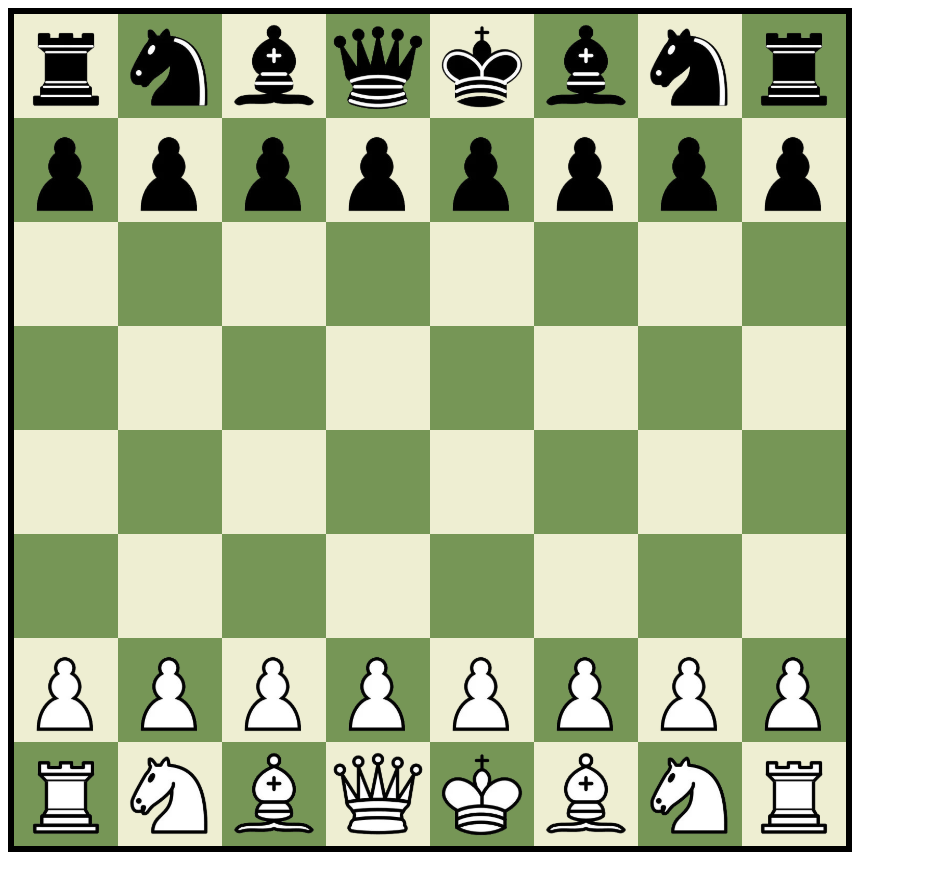
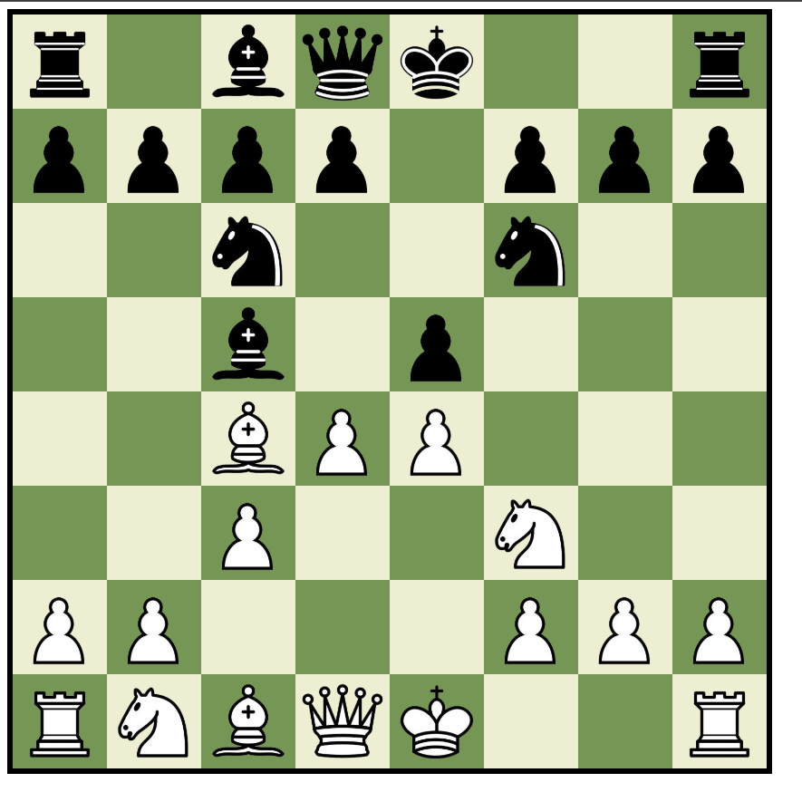
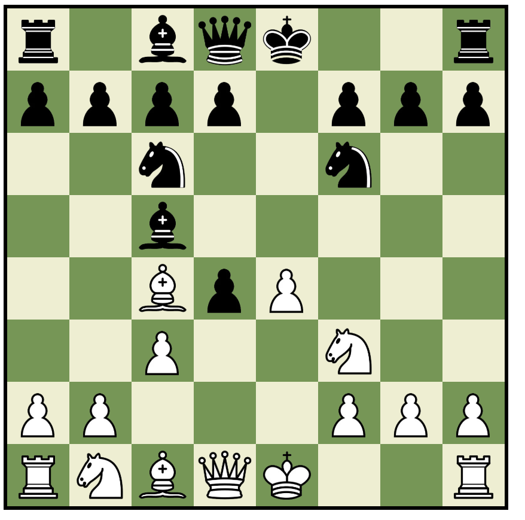
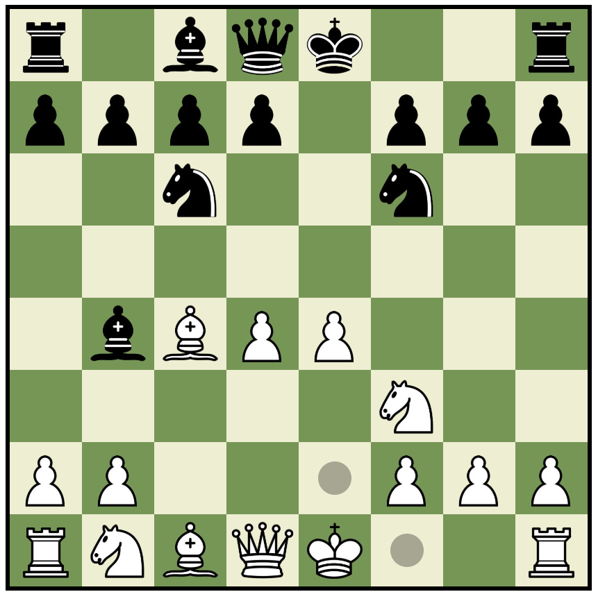
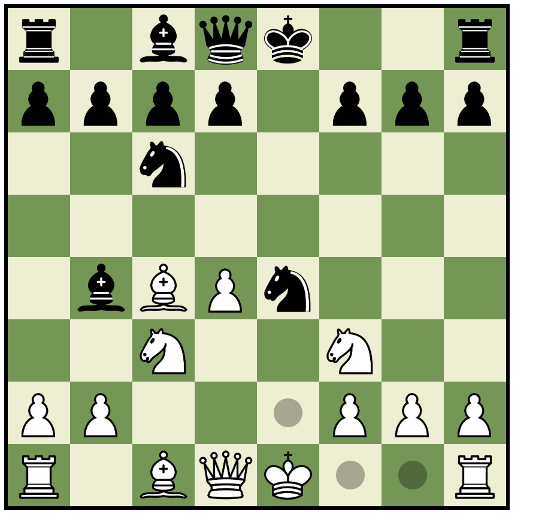
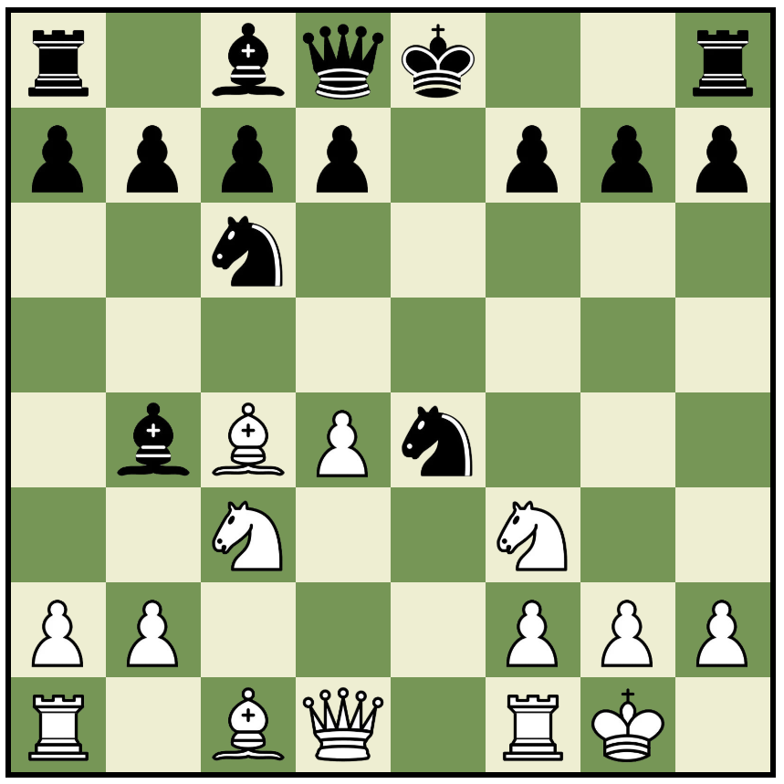
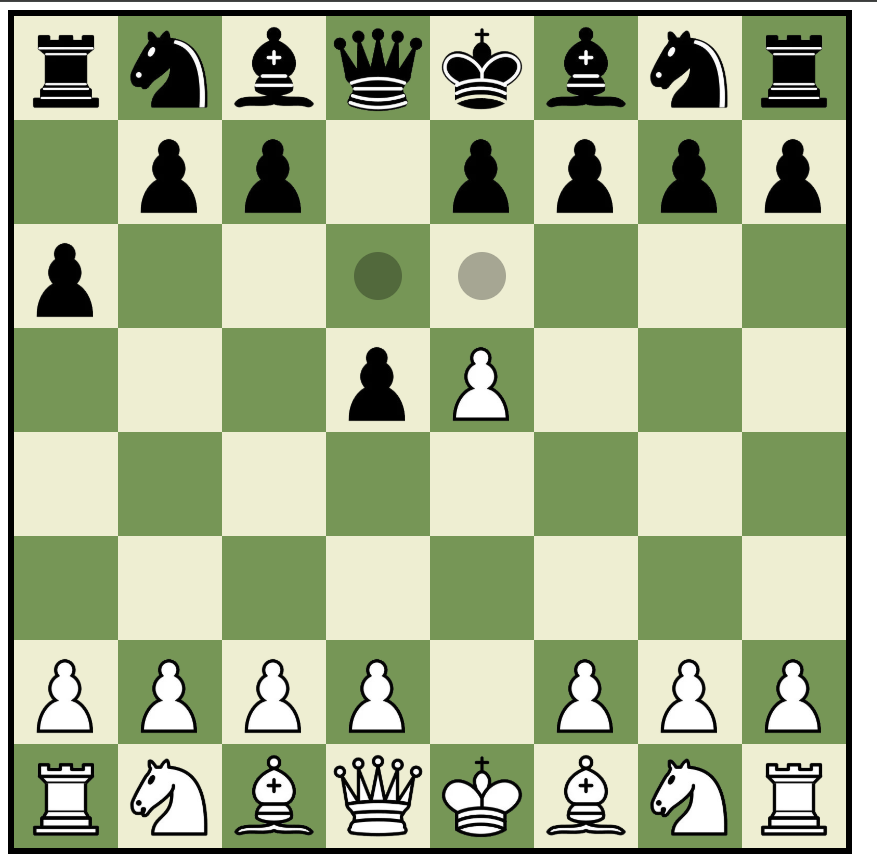
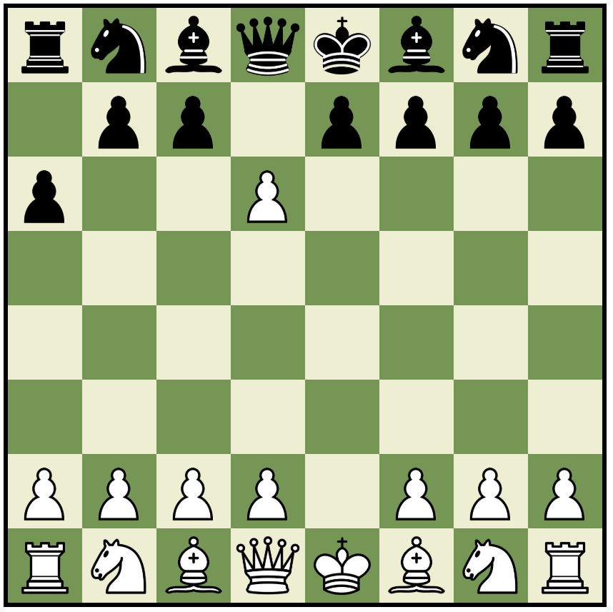
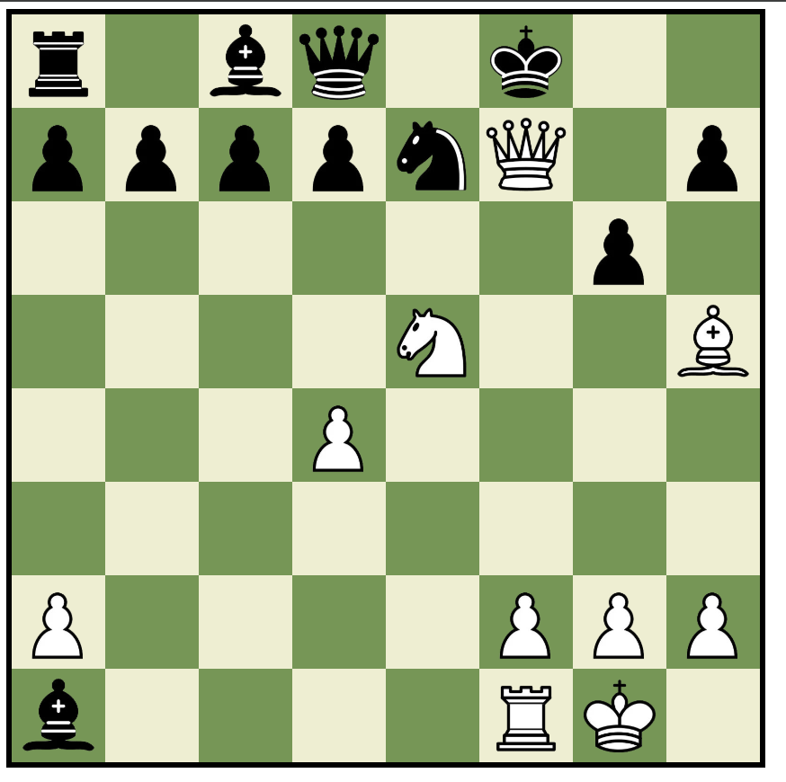

# ♟️ React Chess Game  

An **interactive Chess game** built with **React.js**, designed for **two players**. This project leverages **React's state management** to track game progress while providing a **clean and user-friendly interface** using **HTML and CSS**.  

## 🚀 Live Demo

You can check out the live version of this project here:  
👉 [Live Demo](https://chess-react-js.vercel.app/)

## 🎯 Features  

- **Two-Player Mode** – Play against a friend in a local match.  
- **Real-Time Game State Management** – React handles board updates and moves.  
- **Move Validation** – Ensures only legal chess moves are allowed.  
- **Piece Highlighting** – Indicates valid moves for selected pieces.  
- **Responsive & Modern UI** – Styled with **CSS** for a polished experience.  

## 🛠️ Technologies Used  

- **React.js** – Handles game logic and state.  
- **CSS** – Provides a sleek and responsive interface.  

## 📸 Screenshots  

### Homepage  


### Gameplay  


### Capture  


### Check  


### Castling  
<p align="center">
  
  
</p> 

### En Passant  
<p align="center">
  
  
</p> 

### Checkmate


## 🚀 Installation & Setup  

1. Clone the repository:  
   ```bash
   git clone https://github.com/vladig98/Chess-React.js-.git
   cd Chess-React.js-
   ```  
2. Install dependencies:  
   ```bash
   npm install
   ```  
3. Build the app
   ```bash
   npm run build
   ```
4. Start the development server:  
   ```bash
   npm run preview
   ```  

## 🎮 How to Play  

1. **Select a piece** to highlight its valid moves.  
2. **Click on a valid square** to move the selected piece.  
3. Players take turns making moves **until checkmate or stalemate** occurs.  
4. Enjoy an **interactive and engaging chess experience!**  

## 🛠️ Contributing  

Contributions are welcome! Feel free to **fork** the repository, create a **new branch**, and submit a **pull request**.  

## 📄 License  

This project is licensed under the **MIT License**.  

---

**♟️ Challenge a friend and test your strategy with this React-powered Chess game! 🚀**  

- TODO:
	- Code Reusability: refactor some of the repeated code and generate new functions if needed
	- Consistency and Naming: Have better and more consistent names for variables and functions
	- Documentation: add more comments to understand what is going on
	- Testing: add unit tests
	- Implementations: add promotions, implement endgames (mate, stalemate, draws repeation, 50 moves rule)
	- Bugs: Fix bugs (if any)
	- Check commented out code in HelperMethods
